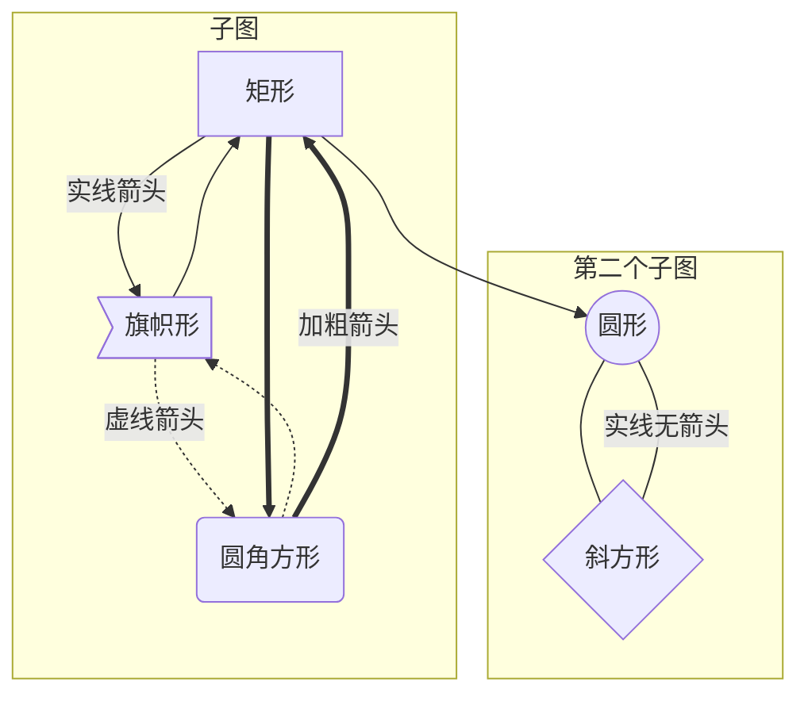
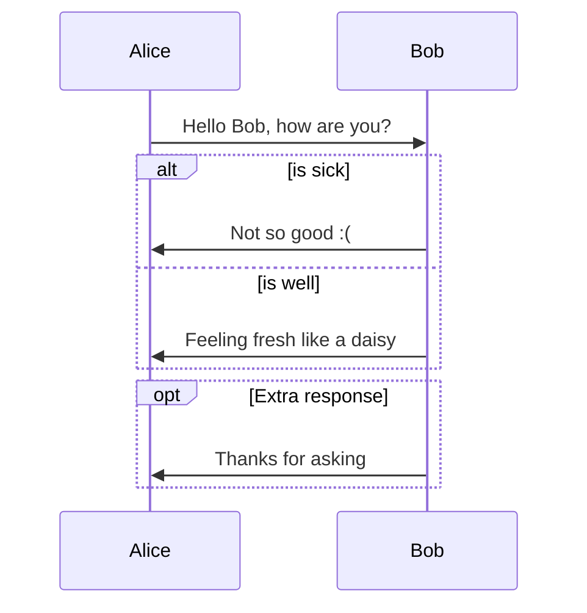

#Markdown和Haroopad介绍文档  
[TOC "float:right"]  
##什么是Markdown  
Markdown 是一种轻量级标记语言，创始人为约翰·格鲁伯（John Gruber）。简而言之的说，它可以通过类似HTML的标记语法，使普通文本内容具有一定的格式。  
###Markdown有哪些优点  
* 纯文本实现，使用任何文本编辑器均可编辑，全平台通用。  
* 排版清晰简洁，可读性较高，使用扩展可以获得更多语法格式支持，漂亮美观。  
* 语法简洁，上手较快，任何人均可在短时间内学会。即使不会语法的读者，也可以读懂其原始文件的内容。  
* 丰富的工具链支持：  
    - 编辑器：各种支持所见即所得的编辑器，如本文介绍的Haroopad。  
    - 平台支持：各大博客系统、Wiki系统均有相关插件，代码托管平台Github也支持使用Markdown来编写Readme文件。  
    - 和其他格式进行转化：可以方便的转化为HTML文件等。  
   
###Markdown的基本语法  
Markdown的基本语法非常简单，本文即用Markdown完成。  
####标题  
可以在标题内容前输入特定数量的井号('#')来实现对应级别的HTML样式的标题(HTML提供六级标题)。例如：  
    # 一级标题  
    #### 四级标题  
一级和二级标题还有一种写法：  
    一级标题  
    ===================  
    二级标题  
    --------------------  
####特殊格式字体  
在需要改变的文字片段前后 使用一对符号可以改变文字为特殊格式：  
* 粗体     使用`**文字**`或者`__文字__`    效果：**这里请大家尤其注意！**  
* 斜体    使用`*文字*`或者`_文字_`    效果：会不调用父类的 *析构函数* 呢？  
* 高亮    使用`==文字==`    效果：==这里是高亮的重点==，但这里不是。  
* 下划线    使用`++文字++`    效果：如果此时的++判断结果为真++……  
* 删除线    使用`~~文字~~`    效果：~~1.2的版本已经修复这个Bug？~~  
* 上角标    使用`^文字^`    效果：单位圆的方程式是x^2^+y^2^=1。  
* 下角标    使用`~文字~`    效果：最常见的氧化反应是C+O~2~=CO~2~  
   
####外部内容嵌入  
* 图像 使用``来贴入图片 效果：  
  
* 链接 使用`[linkText](url)`来插入链接 效果：  
[博客首页](http://www.walkcd.com)  
* 电子邮件 使用`<邮件地址>`来插入邮件地址 效果：<cdsama@gmail.com>  
   
####列表  
#####无序列表  
使用如下格式(*+-可以任意替换):  
```  
    * 第一章  
    * 第二章  
        + 第一条  
        + 第二条  
            - 第一则  
```  
效果：  
* 第一章  
* 第二章  
    * 第一条  
    * 第二条  
        * 第一则  
   
#####有序列表  
使用如下格式(即为效果)：  
1. 内容  
2. 内容  
3. 内容  
   
####表格  
简单表格如下，分号的位置表示对齐方式：  
```  
|这里是列名一|列二|三|  
|:-|:-:|-:|  
|这列是左对齐|这列是居中对齐|这列是右对齐|  
|左对齐|居中对齐|右对齐|  
```  
效果：  
   
|这里是列名一|列二|三|  
|:-|:-:|-:|  
|这列是左对齐|这列是居中对齐|这列是右对齐|  
|左对齐|居中对齐|右对齐|  
|1|2|3|  
   
####分割线  
以下三个连续符号构成一个分割线，分别是三种不同的分割线：  
`***`  
`---`  
`___`  
效果：  
***  
   
---  
   
___  
   
####换行、空格和标记符号  
在浏览器中一般情况下，Markdown会删除所有换行和空格，打乱原有的缩进和排版。通过回车和至少两个空格可以强制换行。  
要打出连续空格可以用输入法输入全角中文空格或者：  
半字大的空白` `或` `  
全字大的空白` `或` `  
不断行的空白格` `或` `  
若要输出符号原本的意思可以加斜线\来输出 例如：  
\* 不是列表  
   
####引用  
使用右尖括号即可插入一段引用，例如：  
```  
> 这里是一段引用  
>> 书是人类进步的阶梯。 --高尔基  
>  
> 退出二级引用  
```  
效果：  
> 这里是一段引用  
>> 书是人类进步的阶梯。 --高尔基  
>  
> 退出二级引用  
   
####代码  
使用一对反引号即可包含一个行内代码使用一对三个反引号可以包括多行代码，另外多行Tab也可以用于代码段，例如：  
`code`  
```  
code blocks  
```  
效果：`print("hello");`  
```  
#include <iostream>  
int main()  
{  
    std::cout<<"hello world!""<<std::endl;  
    return 0;  
}  
```  
##Haroopad介绍  
Haroopad是一个韩国人写的Markdown编辑器，项目主页是：  
[Haroopad - The Next Document processor based on Markdown](http://pad.haroopress.com/)  
###Haroopad的优点和缺点  
优点：  
* 跨Windows、Mac、Linux三大平台。  
* 支持实时渲染，可以在编写的时候实时查看效果。  
* 支持复制、导出到HTML。  
* 支持多种编程语言语法高亮。  
* 支持绘制各种流程时序图等非标准Markdown格式。  
   
缺点：  
* 暂时不支持导出到PDF等格式  
   
###Haroopad支持的额外语法  
####目录  
单行插入[toc]或[TOC]即可生成目录  
####脚注  
使用`[^id]` `[^id]:text`即可生成一对脚注 [^demo]  
####代码语法高亮  
在```后加入编程语言名称  
例如````python`  
```python  
@requires_authorization  
def somefunc(param1='', param2=0):  
    '''A docstring'''  
    if param1 > param2: # interesting  
        print 'Greater'  
    return (param2 - param1 + 1) or None  
class SomeClass:  
    pass  
>>> message = '''interpreter  
... prompt'''  
```  
####计划任务列表  
使用`- [ ] task name` `- [x] finished task`来创建计划任务。  
效果：  
- [x] 任务1  
- [x] 任务2  
   
####图像绘制  
图像绘制使用了mermaid引擎([访问该项目地址](https://github.com/knsv/mermaid))。  
目前支持流程图和时序图，可以在该项目Wiki上查看更多用法，以下列举两个最基本的例子。  
流程图：  
   

   
时序图：  

   
   
[^demo]:这里是一个示例脚注。 